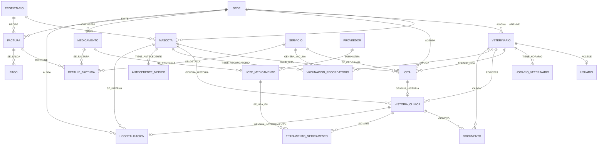
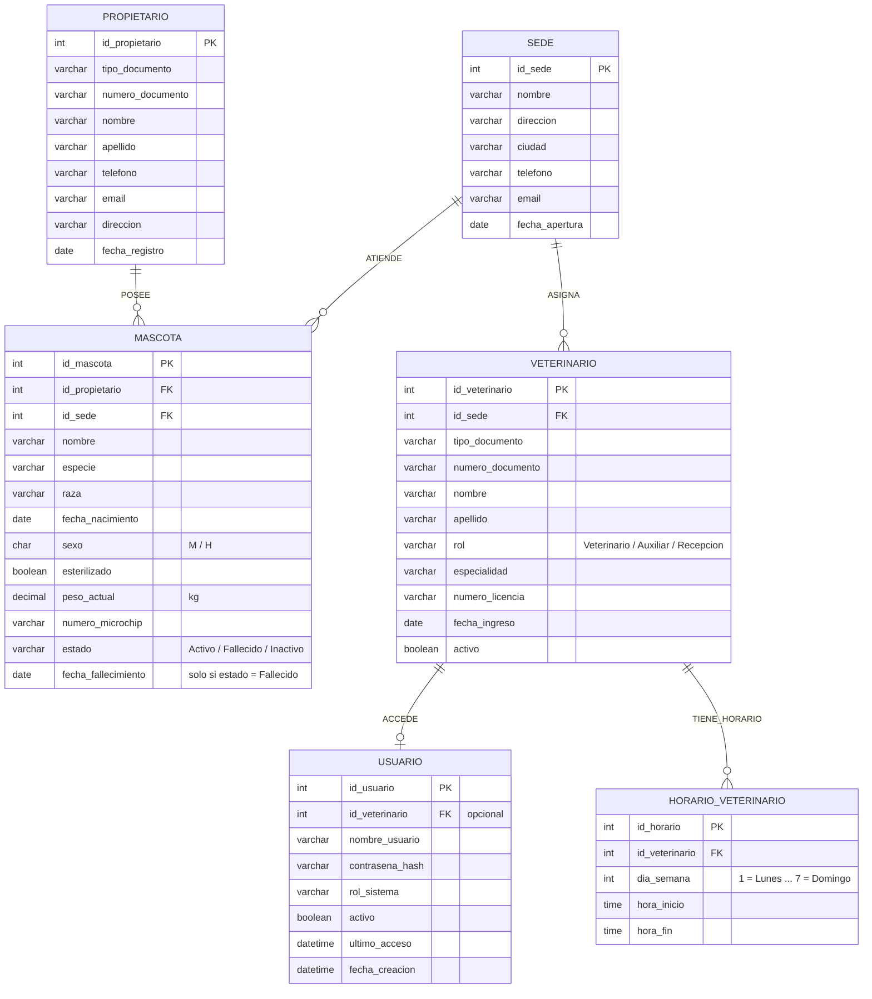
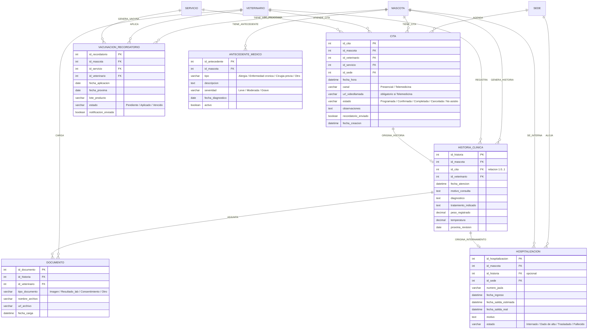
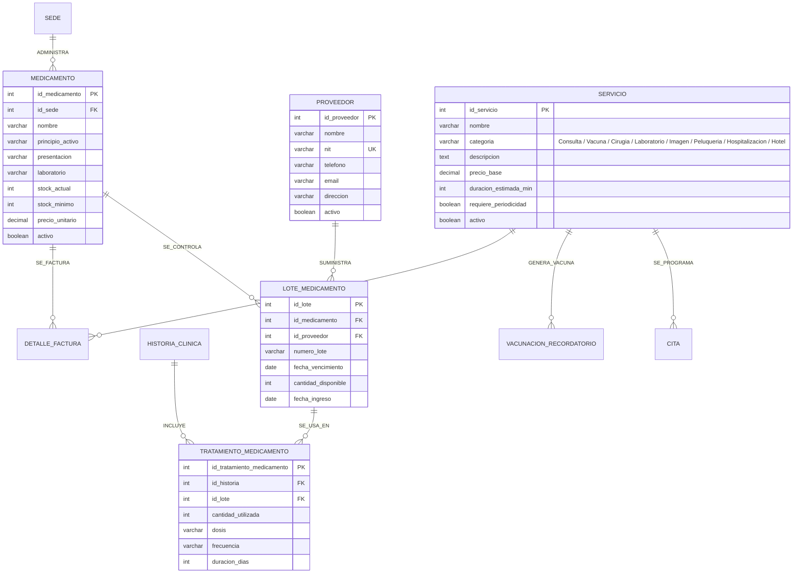
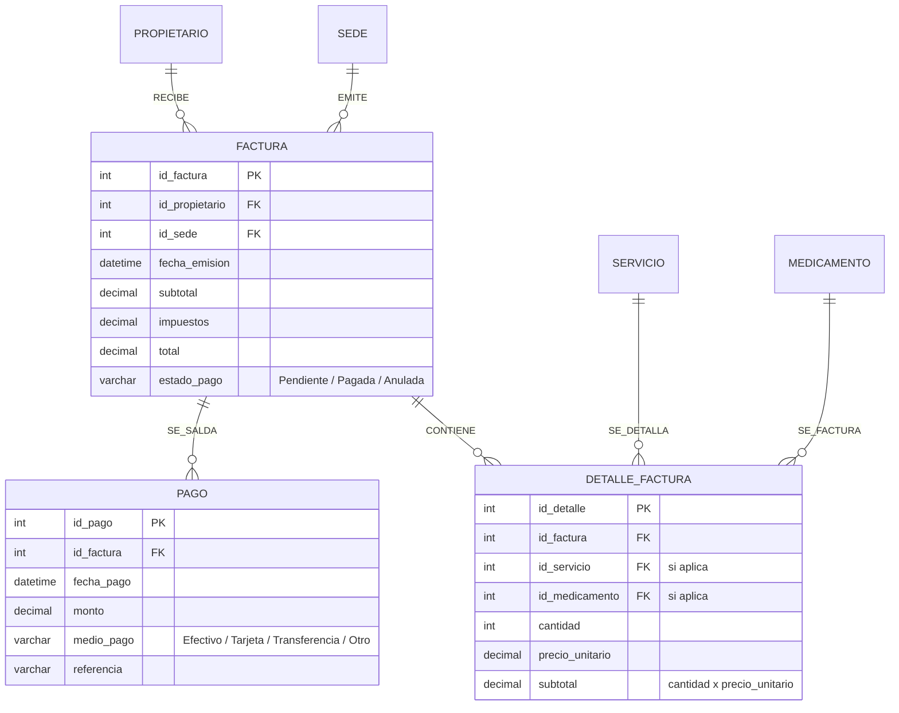

# Diagrama Entidad-Relación — Clínica Veterinaria

Modelo conceptual original (20 entidades, 32 relaciones), listo para renderizarse con **Mermaid** (GitHub, GitLab, Obsidian, VS Code con extensión Mermaid, <https://mermaid.live>).

Los atributos incluyen las llaves foráneas indicadas en el esquema de la actividad exploratoria (el PDF las omitía o las mostraba truncadas).

**Notación de cardinalidad**

| Símbolo | Significado |
| :-- | :-- |
| `\|\|--o{` | Uno a muchos (1:N) |
| `\|\|--o\|` | Uno a cero-o-uno (1:0..1) |
| `PK` / `FK` / `UK` | Llave primaria / foránea / única (no primaria) |

---

## 1. Diagrama general de entidades y relaciones

---

## 2. Diagramas con atributos por módulo

### 2.1 Módulo Núcleo (Sede, Propietario, Mascota, Veterinario, Usuario, Horario)

### 2.2 Módulo Clínico (Cita, Historia clínica, Antecedente, Hospitalización, Documento, Vacunación)

### 2.3 Módulo Inventario (Servicio, Proveedor, Medicamento, Lote, Tratamiento)

### 2.4 Módulo Facturación (Factura, Detalle, Pago)

---

## 3. Catálogo de relaciones

| # | Origen | Destino | Cardinalidad | Nombre |
| :-- | :-- | :-- | :-- | :-- |
| 1 | Sede | Mascota | 1:N | ATIENDE |
| 2 | Sede | Veterinario | 1:N | ASIGNA |
| 3 | Sede | Cita | 1:N | AGENDA |
| 4 | Sede | Medicamento | 1:N | ADMINISTRA |
| 5 | Sede | Factura | 1:N | EMITE |
| 6 | Sede | Hospitalización | 1:N | ALOJA |
| 7 | Propietario | Mascota | 1:N | POSEE |
| 8 | Propietario | Factura | 1:N | RECIBE |
| 9 | Mascota | Cita | 1:N | TIENE_CITA |
| 10 | Mascota | Historia clínica | 1:N | GENERA_HISTORIA |
| 11 | Mascota | Vacunación/Recordatorio | 1:N | TIENE_RECORDATORIO |
| 12 | Mascota | Antecedente médico | 1:N | TIENE_ANTECEDENTE |
| 13 | Mascota | Hospitalización | 1:N | SE_INTERNA |
| 14 | Veterinario | Usuario | 1:0..1 | ACCEDE |
| 15 | Veterinario | Horario | 1:N | TIENE_HORARIO |
| 16 | Veterinario | Cita | 1:N | ATIENDE_CITA |
| 17 | Veterinario | Historia clínica | 1:N | REGISTRA |
| 18 | Veterinario | Vacunación/Recordatorio | 1:N | APLICA |
| 19 | Veterinario | Documento | 1:N | CARGA |
| 20 | Servicio | Cita | 1:N | SE_PROGRAMA |
| 21 | Servicio | Vacunación/Recordatorio | 1:N | GENERA_VACUNA |
| 22 | Servicio | Detalle factura | 1:N | SE_DETALLA |
| 23 | Proveedor | Lote medicamento | 1:N | SUMINISTRA |
| 24 | Cita | Historia clínica | 1:0..1 | ORIGINA_HISTORIA |
| 25 | Historia clínica | Documento | 1:N | ADJUNTA |
| 26 | Historia clínica | Tratamiento medicamento | 1:N | INCLUYE |
| 27 | Historia clínica | Hospitalización | 1:0..1 | ORIGINA_INTERNAMIENTO |
| 28 | Medicamento | Lote medicamento | 1:N | SE_CONTROLA |
| 29 | Medicamento | Detalle factura | 1:N | SE_FACTURA |
| 30 | Lote medicamento | Tratamiento medicamento | 1:N | SE_USA_EN |
| 31 | Factura | Detalle factura | 1:N | CONTIENE |
| 32 | Factura | Pago | 1:N | SE_SALDA |

> El modelo **normalizado** (34 tablas) está en `VET_Schema.dbml` y el proceso en `Normalizacion.md`.
